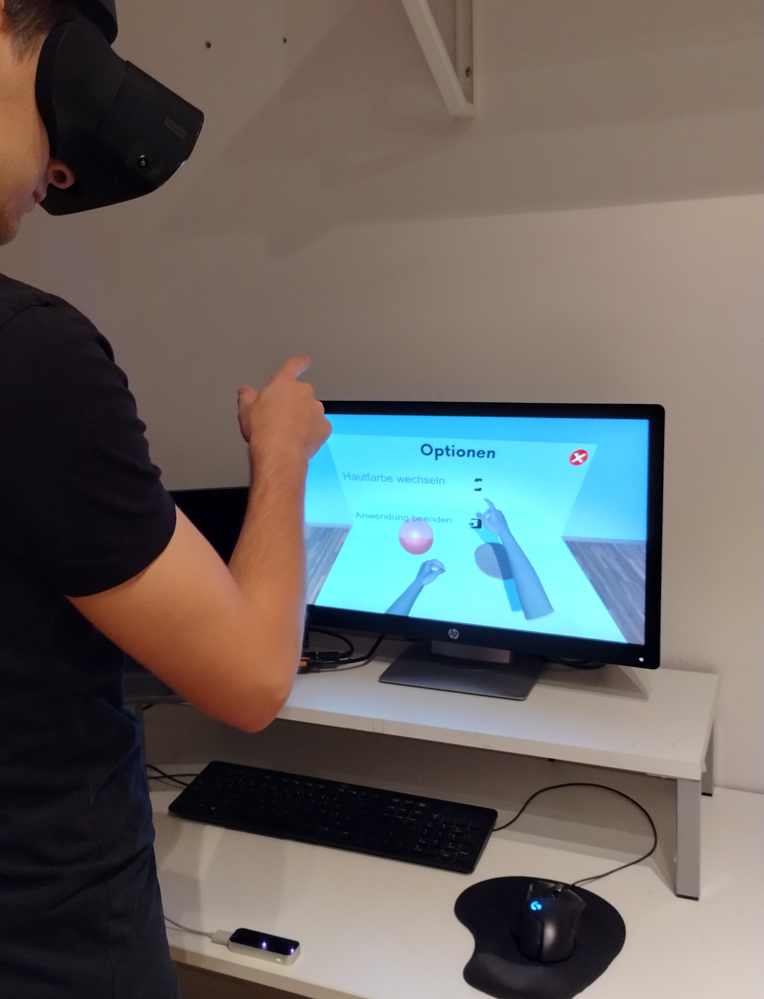

# SelfCuttingSimulationVR

## Abstract

Virtual Reality has been used in various research projects about treatments and therapies for different psychological disorders. In existing literature, it has shown to be an effective tool for various application cases. Upon the request of an Austrian medical university for a VR simulation to investigate its usage in the field of self-cutting amongst children and juveniles, this work deals with the process of creating a corresponding VR product. After comparing available tools and technologies, the most suitable ones were chosen and used for the purpose of this work. To be specific, Unity was chosen as the game engine, Blender was used as a 3D modeling tool, the Leap Motion Controller was picked to track the movements of users’ hands and replace traditional controllers, and VR glasses by Oculus were used to enter the virtual reality environment. The simulation itself is a virtual reality environment that was created to give users the opportunity to perform self-cutting virtually without causing harm to themselves in reality. Bloody wounds were created to provide users with a realistic experience. Therefore, users can pick up a knife and cut into their forearm within the virtual environment. Skin colour personalisation is offered to give users the opportunity to coordinate their virtual arms to their real arms. A simulation test using a convenience sample was done to see whether the simulation is suitable for inexperienced VR users, whether it creates a realistic experience and runs smoothly from a technical point of view. The results showed that the participants were able to navigate intuitively and perceived the simulation positively. Some technical issues were found and later improved. Overall, this work produced promising results that can be used for research purposes as requested by an Austrian medical university.

Bachelor Thesis Valentin Röcklinger - August 8, 2022

## Simulation in action

